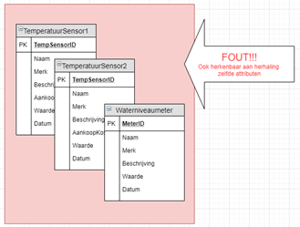

# Project ONE Manual

## Controleer of jouw database model voldoet aan de volgende eisen:

- Het model beantwoordt minstens aan 3NF. (**verplicht**)
- Hou de **historiek** van **alle** sensormetingen bij in **één afzonderlijke tabel** (_wanneer wordt wat opgemeten?_) Elke entry in deze tabel stockeert automatisch zijn meetdatum en -tijd (=default waarde invullen in design).
- Hou ook de historiek van actuatoren bij ('_wanneer gebeurt wat_?').
- Dus, je houdt data van **sensoren én actuatoren** bij. Je beslist zelf of je hiervoor één tabel (voorkeur) of meerdere tabellen gebruikt. Zorg dat je beide afzonderlijk kan opvragen.
- Kolommen met zelfde naam, aangevuld met nummer zijn fout (vb sensor1, sensor2, actuator1, … )!
- Controleer de uitbreidbaarheid: een extra sensor/actuator mag **GEEN extra tabel/kolom** betekenen.
- Hou je nog andere zaken bij (personen/dranken/dieren/spelgegevens/ploegen/uitslagen/...): maak dan hiervoor extra tabellen aan.

## Herhaling uit laboles: volgende opbouw voor het model is onvoldoende flexibel (en dus foutief).

Dit is een beter model:

## **Waar hou je ook rekening mee?**

- De veldnamen in de verschillende tabellen zijn duidelijk en verklaren zichzelf.
- Wees **consequent** in die **naamgeving**: veldnamen starten ofwel allemaal met een kleine ofwel allemaal met een hoofdletter. Analoog bij de tabelnamen, enofwel allemaal enkelvoud ofwel allemaal meervoud
- Gebruik de **juiste datatypes**:
  - Waarde uitlezen van sensor: ga vooraf na of deze een int of float (double) is
  - Een datum is geen tekst
  - Datetime/Timestamp: ok. Time is enkel voor een tijdsduur en niet voor een datum
  - Status van een actuator: géén varchar, wel een boolean of tinyint
- Bij elke veld vraag je zich bewust af of deze **al dan niet NULL** kan zijn.
- Op velden of eigenschappen waarop zal gezocht worden, plaats je **indexen** voor het bevorderen van de zoeksnelheid.
- Velden die uniek zijn en geen PK geworden zijn , worden als "**unique**" aangeduid in tabel design.
- Vul voldoende **testdata** in. Dit is niet alleen belangrijk als test, maar oogt ook beter bij een demo. Zorg voor minsten 50 testmetingen. Tip: je kan gegevens inbrengen via een www.generatedata.com of vanuit Excel. (Hou je een tabel met de verschillende sensoren/actuatoren bij, dan beperk je deze tabel tot de gebruikte sensoren/actuatoren).

## **Wat dien je in?**

- Een screenshot van jouw EER-Diagram uit MySQLWorkbench.
- Een dump (\*.sql) van jouw database (50 rijen testdata)

## **Toelichting?**

Je wordt na het toermoment gecontacteerd als extra toelichting noodzakelijk is. Wees standby op het juiste moment...

## **Problemen met EXPORTEREN?**

Sommigen ondervinden een probleem wanneer ze een dump file proberen te maken van de database . Namelijk, bij het exporteren verschijnt er een melding dat de MariaDB een recentere versie is dan de mySQL op de pc.

Wat kun je doen om dit op te lossen?

- Stap1: download via [https://downloads.mysql.com/archives/community/Links to an external site.](https://downloads.mysql.com/archives/community/) een oudere versie (zip) van mysql server, en unzip enkel de mysqldump.exe (je mag ze ergens plaatsen op je schijf - liefst de huidige niet overschrijven)
  
- Stap 2: Verander het path van de mysqldump tool naar de geunzipte mysqldump.exe (via Menu- Edit - Preferences)
  
- Stap3: herstart MySql Workbench
